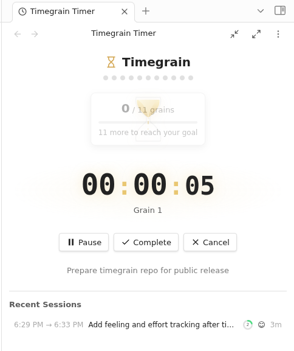
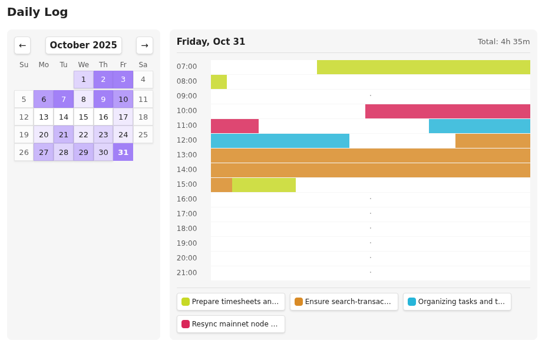
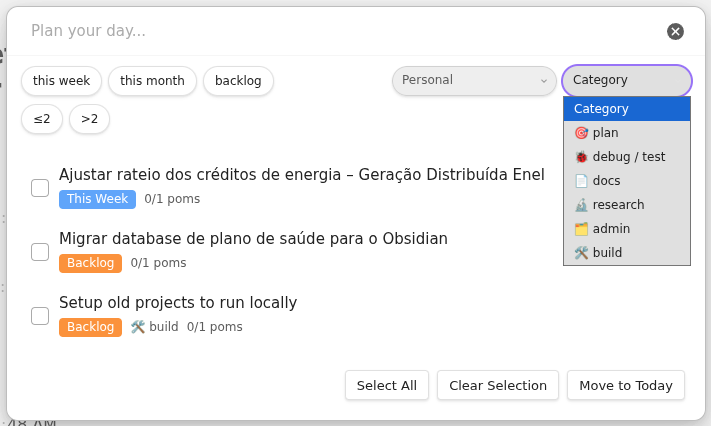
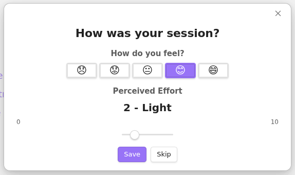
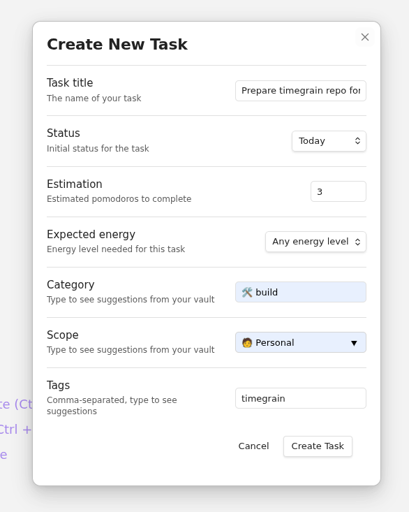

# Timegrain

[](https://github.com/linconvidal/timegrain-obsidian-plugin/releases)
[](LICENSE)

> *Harvest your time, grain by grain*

A Pomodoro timer plugin for [Obsidian](https://obsidian.md) that integrates deeply with your notes. Track time on tasks, log how you feel, and gain insights into your productivity patterns—all within your vault.





---

## Why Timegrain?

Unlike standalone timer apps, Timegrain lives inside Obsidian and connects directly to your notes:

- **Your tasks are your notes** — No separate task database. Any markdown file can be a task.
- **Sessions are searchable** — Every work session is saved as a markdown file you can query, link, and review.
- **Energy awareness** — Track how you feel after each session to discover your peak productivity hours.
- **Visual history** — See your work patterns on a calendar heat map with timeline visualization.

---

## Features

### Timer
- Start/pause/resume/cancel/complete timer sessions
- Pomodoro tracking with configurable duration (default 25 min)
- Audio notification on pomodoro completion
- Status bar integration showing current task and time
- Automatic session recovery on startup (never lose a session)

### Task Management
- Create tasks with title, status, estimation, expected energy, and category
- **Plan your day**: Batch-select tasks to move to "Today" status
- Fuzzy search to quickly find and start any task
- Auto-rollover of stale "Today" tasks to "This Week"
- Supports multiple task statuses: today, in progress, this week, this month, backlog, done, and more



### Energy Tracking
- Rate how you feel (5 levels) and perceived effort (0-10) after each session
- Tracks hour-of-day and day-of-week patterns
- Analyzes your peak productivity times
- Helps you schedule demanding work when you're at your best



### Daily Log & Analytics
- Interactive calendar with activity heat map
- Timeline visualization of work sessions
- Color-coded by task for quick pattern recognition
- Navigate to any date to review your history
- Track daily goals and streaks

---

## Installation

### From Obsidian Community Plugins

1. Open Obsidian Settings
2. Go to **Community plugins** and disable **Restricted mode**
3. Click **Browse** and search for "Timegrain"
4. Click **Install**, then **Enable**

### Manual Installation

1. Download `main.js`, `manifest.json`, and `styles.css` from the [latest release](https://github.com/linconvidal/timegrain-obsidian-plugin/releases/latest)
2. Create folder: `<YourVault>/.obsidian/plugins/timegrain/`
3. Copy the downloaded files into that folder
4. Restart Obsidian
5. Enable "Timegrain" in Settings → Community plugins

---

## Quick Start

### 1. Create your first task

Run the command **Timegrain: Create new task** (Ctrl/Cmd + P) and fill in:
- **Title**: What you're working on
- **Status**: Set to "today" to work on it now
- **Estimation**: How many pomodoros you think it'll take
- **Expected Energy**: How demanding is this task? (Any/Low/Normal/High)



This creates a markdown file like:

```markdown
---
title: Write documentation
status: today
estimation: 3
expected energy: 3
category: writing
creation date: 2024-01-15 10:00
---

# Write documentation

Notes about this task...
```

### 2. Start the timer

- Run **Timegrain: Open timer panel** to see the timer in your sidebar
- Click on a task to start, or run **Timegrain: Start timer with current note**
- The timer begins tracking your session

### 3. Complete your session

When you're done (or want a break):
- Click **Complete** or run **Timegrain: Complete timer session**
- Rate how you feel and your perceived effort
- Your session is saved automatically

### 4. Review your progress

Run **Timegrain: Open daily log** to see:
- Calendar heat map of your activity
- Timeline of today's sessions
- Which tasks you worked on

---

## Commands

Access via Command Palette (Ctrl/Cmd + P):

| Command | Description |
|---------|-------------|
| **Start timer with current note** | Start timing the currently active file |
| **Start timer: Select task...** | Fuzzy search to pick any task |
| **Pause/resume timer** | Toggle timer pause state |
| **Complete timer session** | Finish session and log how you feel |
| **Cancel timer** | Cancel without completing (abandons session) |
| **Open timer panel** | Show timer in sidebar |
| **Open daily log** | Open calendar and timeline view |
| **Create new task** | Open task creation form |
| **Plan your day** | Batch-select tasks for today |

---

## Data Format

Timegrain stores everything as plain markdown with YAML frontmatter. Your data is always accessible, searchable, and portable.

### Tasks

Any markdown file matching `*/tasks/*.md` is recognized as a task. Example:

```yaml
---
title: Implement user authentication
status: in progress
estimation: 5
expected energy: 5
category: backend
scope: v2.0
tags:
  - security
  - priority
creation date: 2024-01-15 10:00
modification date: 2024-01-16 14:30
due to: 2024-01-20
depends on: "[[Setup database]]"
---
```

**Status options:**
- `today` — Planned for today
- `in progress` — Currently working on
- `this week` — Planned for this week
- `this month` — Planned for this month
- `backlog` — Future work
- `done` — Completed
- `archived` — No longer relevant
- `on hold` — Paused
- `needs review` — Awaiting review

### Sessions

Sessions are stored in `timer_sessions/` as markdown files:

```yaml
---
started: 2024-01-15T10:00:00
ended: 2024-01-15T10:25:00
task: "[[Implement user authentication]]"
feeling: strong
perceived_effort: 4
hour_of_day: 10
day_of_week: monday
status: completed
---
```

Each session links to its task, making it easy to see all sessions for a given task using Obsidian's backlinks.

---

## Configuration

Go to **Settings → Timegrain** to customize:

### Paths
| Setting | Description | Default |
|---------|-------------|---------|
| Timer sessions directory | Where session files are saved | `timer_sessions` |
| Default task directory | Where new tasks are created | `tasks` |

### Timer
| Setting | Description | Default |
|---------|-------------|---------|
| Cycle duration | Pomodoro length in minutes | `25` |
| Play sound | Audio notification on pomodoro completion | `true` |
| Daily goal | Target pomodoros per day | `8` |

### UI
| Setting | Description | Default |
|---------|-------------|---------|
| Show status bar | Display timer in Obsidian status bar | `true` |
| Status bar click action | What happens when clicking status bar | `open-timer` |

### Behavior
| Setting | Description | Default |
|---------|-------------|---------|
| Rollover stale tasks | Auto-move old "Today" tasks to "This Week" | `true` |

---

## Tips & Tricks

### Use templates for tasks

Create a template file and use Obsidian's Templates plugin to quickly create new tasks with consistent frontmatter.

### Link sessions to daily notes

Since sessions are markdown files with dates, you can query them in your daily notes using Dataview:

```dataview
TABLE started, task, feeling, perceived_effort
FROM "timer_sessions"
WHERE file.day = this.file.day
SORT started ASC
```

### Keyboard shortcuts

Set up hotkeys in Settings → Hotkeys for quick access:
- `Ctrl+Shift+S` — Start/select task
- `Ctrl+Shift+P` — Pause/resume
- `Ctrl+Shift+C` — Complete session

### Task naming convention

Use a consistent naming pattern for tasks to make searching easier:
- `[PROJECT] Task name`
- `Category - Task name`

---

## FAQ

### Where is my data stored?

All data is stored in your vault as plain markdown files:
- Tasks: Any file matching `*/tasks/*.md`
- Sessions: Files in `timer_sessions/` folder

### Can I edit task/session files manually?

Yes! They're just markdown files. Edit the YAML frontmatter or note content as needed.

### What happens if Obsidian crashes during a session?

Timegrain saves timer state every 5 seconds. On next startup, you'll be prompted to resume or abandon the unfinished session.

### Does it work on mobile?

Yes, Timegrain is fully compatible with Obsidian Mobile.

### Can I use this with existing task files?

Yes, as long as your files are in a `*/tasks/*.md` path and have a `status` field in frontmatter, Timegrain will recognize them.

---

## Contributing

Contributions are welcome! Here's how you can help:

1. **Report bugs** — Open an issue with steps to reproduce
2. **Suggest features** — Open an issue describing your idea
3. **Submit PRs** — Fork, create a branch, make changes, submit a pull request

### Development Setup

```bash
# Clone the repo
git clone https://github.com/linconvidal/timegrain-obsidian-plugin.git
cd timegrain-obsidian-plugin

# Install dependencies
npm install

# Development with watch mode
npm run dev

# Run tests
npm test

# Production build
npm run build
```

### Project Structure

```
src/
├── main.ts              # Plugin entry point
├── types.ts             # TypeScript interfaces
├── components/          # React UI components
├── hooks/               # React hooks
├── modals/              # Obsidian modals
├── services/            # Timer service
├── data/                # Repositories
└── utils/               # Utilities

tests/                   # Vitest tests
```

---

## Support

- **Issues**: [GitHub Issues](https://github.com/linconvidal/timegrain-obsidian-plugin/issues)
- **Discussions**: [GitHub Discussions](https://github.com/linconvidal/timegrain-obsidian-plugin/discussions)

If you find Timegrain useful, consider:
- Starring the repo on GitHub
- Sharing it with others
- Contributing improvements

---

## License

[MIT](LICENSE) © Lincon Vidal

---

*Harvest your time, grain by grain.*
